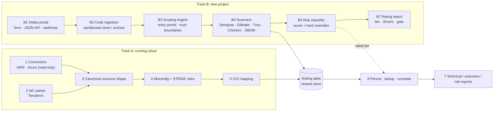

# Cloud-Agnostic Threat Modeling & Project Risk Platform

A security platform that rates risk from two directions. Its two halves feed the same findings store:

- **Track B: new project intake.** A team submits a project before it ships. The platform clones the code, works out what the system actually is, scans it with four security tools, and rates it **LOW / MEDIUM / HIGH** with a gate decision that CI can enforce.
- **Track A: existing cloud estate.** The platform scans AWS accounts and Azure subscriptions that are already running, using read-only access. It normalizes their configuration into one cloud-neutral shape, runs misconfiguration and STRIDE analysis, and maps every finding to a CIS Foundations control.

The two tracks share a normalization schema, a `finding` table, a policy library and a reporting layer. The reason for building both is the **correlation loop**. If a project was rated LOW at intake and later shows up in a scanned cloud account as a public bucket tagged with that project's name, the platform reports the mismatch. Neither track can see that divergence on its own.

Architecture diagram: [`docs/threat-model-platform.drawio`](docs/threat-model-platform.drawio) ([PDF](docs/threat-model-platform.drawio.pdf)). Screenshots of the running platform are in [`Evidence/`](Evidence/README.md).

---

## Contents

1. [How it fits together](#how-it-fits-together)
2. [Track B: project intake and risk rating](#track-b-project-intake-and-risk-rating)
3. [Track A: cloud estate scanning](#track-a-cloud-estate-scanning)
4. [The correlation loop](#the-correlation-loop)
5. [Risk model](#risk-model)
6. [Design principles](#design-principles)
7. [Security posture of the platform itself](#security-posture-of-the-platform-itself)
8. [Tech stack and layout](#tech-stack-and-layout)
9. [Testing](#testing)
10. [Known gaps and roadmap](#known-gaps-and-roadmap)

---

## How it fits together



Both tracks run on one FastAPI application, one Postgres database, one Redis queue and one RQ worker. A code finding and a cloud misconfiguration have the same `Finding` shape, with the same severity vocabulary and STRIDE tags, and they land in the same table. Each `finding` row carries either a `submission_id` (Track B) or a `source_id` (Track A). A check constraint requires one of the two, so a finding can always be traced to where it came from.

---

## Track B: project intake and risk rating

### B1: Intake portal

A server-rendered portal (FastAPI + Jinja2, no JavaScript build chain) with three ways to submit a project:

| Path | Use | Auth |
| --- | --- | --- |
| Web form (`/submit`) | A team submits a repo URL or uploads a zip/tar archive | Signed session cookie; OIDC when configured |
| JSON API (`/api/v1/submissions`) | CI submits a project and reads back the gate | Bearer token |
| Webhook (`/webhooks/git`) | A push or PR to a registered repo triggers a re-scan of the new commit | HMAC signature, verified before the payload is parsed |

The submission comes with a six-question scoping questionnaire covering data classification, internet exposure, authentication, blast radius, compliance scope and third-party access. The questions are defined as data in one module. The form renders from that definition and the classifier scores from it, so the two cannot drift apart. **Every question is required.** If a partial answer were accepted, the classifier would read the gaps as zeros and under-rate the project.

Repository URLs are canonicalized before matching. `https://…/repo`, `…/repo.git` and `git@github.com:…/repo.git` resolve to the same project, so a webhook for a real push is not silently ignored.

### B2: Code ingestion

This is the first stage that handles code the platform does not control, so nothing from the repository is allowed to execute:

- Shallow, single-branch clone with **no submodules, hooks disabled** (`core.hooksPath=/dev/null`), and no credential prompts
- Hard limits on repository size and clone time; a breach kills the job and marks it `failed`
- Archive uploads are checked for zip-slip, absolute paths, symlinks and zip bombs before any file is written
- Each submission gets its own `0700` workspace, which exists only for the length of the job and is destroyed afterwards
- The resolved **commit SHA** is recorded, so every rating is tied to the exact code that was scanned

A detection pass then records languages, package manifests, IaC (Terraform, Dockerfiles, Kubernetes) and CI configuration.

### B3: Project scoping engine

This stage is what makes the rating defensible. Without it, the platform would be rating a questionnaire. With it, the platform rates the system, and it also rates the **gap between what the team declared and what the code shows**.

The scoping engine reads the source and derives:

- **Entry points**: HTTP routes, listeners, `0.0.0.0/0` ingress rules, `LoadBalancer` services, each marked public or not
- **Trust boundaries**: four kinds only (`internet->app`, `app->data`, `app->third-party`, `low-priv->high-priv`). This vocabulary is shared with Track A, so one STRIDE engine can consume a model from either track.
- **Outbound third-party dependencies**: hosts the code talks to, with documentation, schema and package-registry hosts filtered out
- **Scope mismatches**: the declared-vs-observed contradictions (`scope_mismatch.exposure`, `.third_party`, `.blast_radius`)

Detection is deliberately regex-based rather than AST-based. It reads untrusted files in languages it may not know, so when it fails it should find nothing rather than crash.

### B4: Code and supply-chain scanners

| Tool | Covers |
| --- | --- |
| Semgrep (`p/security-audit`, `p/secrets`) | SAST |
| Gitleaks | Secrets in the working tree |
| Trivy | Dependency CVEs, IaC misconfiguration, licences |
| Checkov | IaC misconfiguration (only when B2 found IaC) |
| Trivy CycloneDX | SBOM, stored outside the scan sandbox and downloadable from the report |

Every adapter normalizes its tool's output into the shared `Finding` shape. One severity table maps each tool's vocabulary (for example, "Blocker" means critical), and one STRIDE table tags each finding so a HIGH-tier threat model starts pre-populated.

Two failure modes are handled explicitly, because each one makes the platform report too little:

1. **The exit-code trap.** Gitleaks and Checkov exit `1` when they find something. If an adapter used `check=True`, a successful scan of a vulnerable repo would be recorded as a failed scan, and dirtier repos would produce fewer findings. Exit codes `0` and `1` are both treated as success. A missing scanner binary raises an error, because "tool not installed" must never look like "found nothing".
2. **Partial scans that report success.** Semgrep skips a file it cannot parse and still exits `0`. Checkov counts unparseable files in a summary field. Trivy logs errors to stderr while exiting `0`. Each adapter now returns a `ScanOutcome` containing findings **and** warnings. The worker persists those warnings on the submission, and the report shows them in a **"Scan coverage warnings"** box above the findings table. A reader who stops at the tier still sees that the scan behind it was incomplete, and the JSON API returns the same warnings as `scan_warnings` so a CI gate can see them too.

The worker runs the whole pipeline as one job and advances the submission's status at each step: `queued → cloning → scoping → scanning → classifying → complete / failed`. A failed scan always records the reason.

### B5: Risk classification engine

The engine scores the project and assigns a tier. Weights, caps, thresholds and overrides all live in a versioned policy file ([`policy/risk/risk-model.yaml`](policy/risk/risk-model.yaml)), and each rating records the `model_version` that produced it. See [Risk model](#risk-model) for the math.

Scoring and overrides are kept separate on purpose:

- `classifier.py` computes the score. It is pure math and can be audited on its own.
- `overrides.py` applies the **hard overrides** after scoring. An override can raise the tier but never lower it. Each override that fires is recorded, so when someone challenges a HIGH rating, that list is the answer.

The override conditions in the YAML are **not evaluated as code**. Running `eval` on strings from a policy file would be a code-execution hole in a project built to catch exactly that. Each override id maps to an explicit Python predicate instead. If the YAML names an id that has no predicate, classification fails loudly rather than silently doing nothing.

Every rating also stores its top five **drivers**, each as `{factor, points, evidence}`. A tier with no explanation will not survive its first argument with a delivery team.

### B7: Project risk rating report

The rating page shows the tier, score, drivers, fired overrides, required controls, scan-coverage warnings and the full findings list. It is also available as a downloadable PDF, with the SBOM alongside. One module (`app/risk/gate.py`) turns a tier into a gate decision, so the page, the PDF and the JSON API cannot disagree about what a tier means.

| Tier | Gate | Required before production |
| --- | --- | --- |
| **LOW** | `approved` | Self-serve hardening checklist; re-scan on every PR |
| **MEDIUM** | `conditional` | Criticals and highs remediated or formally accepted; security peer review of the scoped model; clean re-scan before release |
| **HIGH** | `blocked` | Full STRIDE threat model seeded from the B3 model and B4 STRIDE tags; named security architect review; pen test before GA; documented executive risk acceptance for any open criticals |

CI reads `{"tier": "...", "gate": "approved|conditional|blocked"}` from the JSON API and fails the pipeline on `blocked`. Without that gate, the rating would only be advisory and easy to ignore.

---

## Track A: cloud estate scanning

Track B rates code that has not shipped yet. Track A rates infrastructure that is already running. It is a second way into the same pipeline, pointed at live AWS accounts and Azure subscriptions. Its stages are numbered by pipeline position. They were written in dependency order, starting with stage 3, because every other stage emits stage 3's canonical shape.

### Stage 1: Connectors (read-only)

| Cloud | Collects | Identity |
| --- | --- | --- |
| **AWS** | S3, security groups, IAM roles and policies, RDS, CloudTrail (per region, deduplicated, with live logging status) | An assumed role with the AWS-managed `SecurityAudit` policy. No new access key. |
| **Azure** | Storage accounts, NSGs, SQL servers, role assignments, Activity Log diagnostic settings | A service principal with the **Reader** role at subscription scope, using **certificate auth**, so no client secret is stored |

The connectors are read-only in two different ways:

- **AWS is read-only at runtime.** A boto3 `before-call` hook rejects any operation that is not a `List`/`Describe`/`Get` before a request is even built (`refusing to call 'DeleteBucket'…`). STS credential exchange is the one allowed exception, because the read-only role cannot be assumed without it.
- **Azure is read-only by review.** The Azure SDK has no equivalent hook, so the connector's five `list`/`get` calls are read-only by code review. That makes a least-privilege identity more important on Azure, not less.

**Denied permissions are reported as unknown, not guessed.** An early version treated any bucket it could not read as public. Against a real account, that produced false critical findings that buried the real ones. A property the scanner cannot read is now `None`, the denial is recorded as a scan warning, and a dedicated rule (`estate.storage.access_unknown`) says plainly that the bucket could not be checked.

The worker also refuses to file a scan under a source whose account or subscription id differs from the one its credentials actually resolve to. Without that check, a misconfigured profile could silently mislabel an entire scan.

### Stage 2: IaC parser

The parser turns Terraform into the same `Resource` shape the live connectors emit, so one rule engine can judge both a bucket that exists and a bucket that is only declared. It handles the way modern Terraform is actually written. Bucket posture lives in **companion resources** (`aws_s3_bucket_public_access_block`, `aws_s3_bucket_acl`, `aws_security_group_rule`, `azurerm_network_security_rule`…), which the parser collects across the whole tree and merges onto the resources they configure. A parser that only read inline blocks would rate every current module as clean. The parser also handles both the old and new output formats of `python-hcl2`.

### Stage 3: Canonical resource shape

This is the cloud-neutral model. An S3 bucket and an Azure storage account both reach the analysis engine as `storage.bucket` with the same property keys, so each rule is written once, not once per cloud. The model has eight resource types, kept coarse on purpose, because the engine cares what a resource does, not what a vendor calls it.

Boolean properties are **three-valued**: `True`, `False`, or `None` for "could not read". Rules test `is True` / `is False` and never rely on truthiness, so a missing permission is never counted as clean or as broken. Shared helpers answer "is this IAM policy a wildcard grant?" and "how bad is this open port?" in one place, so the live connector and the Terraform parser always agree.

### Stage 4: Misconfiguration and STRIDE analysis

Eleven per-resource rules, plus an account-level check for a missing audit trail. Each one emits the same `Finding` that Track B's scanners emit:

| Area | Rules |
| --- | --- |
| Storage | Public access · access could not be verified · unencrypted · TLS not enforced |
| Network | Open to the internet, **graded by port**: admin ports (22, 3389) or all ports open is critical; 443 is medium |
| Identity | Wildcard permissions · role trusts any principal · (Azure) Owner/Contributor/User Access Administrator at subscription scope |
| Database | Publicly accessible · unencrypted |
| Audit | Trail not multi-region · trail exists but is not logging · no audit trail at all |

Grading by port matters. An early version called every open port critical, and on a real estate that made "critical" meaningless.

### Stage 5: CIS Foundations mapping

The control mapping is a versioned policy file ([`policy/cis/cis-mapping.yaml`](policy/cis/cis-mapping.yaml)) mapping each rule to **CIS AWS Foundations v3.0.0** and **CIS Azure Foundations v2.1.0**. Every control number was checked against the published benchmarks, and five of the first draft's numbers were wrong and got corrected. A rule that is a real finding but has no control in that benchmark version maps to `null`. The report counts those as unmapped and does not invent a citation. Each scan records the mapping version it used.

### Stage 6: Risk store: persist, dedup, correlate

Track A rescans the same accounts repeatedly, so the store is **idempotent**: a bucket that has been public for six months is one finding, not 180. This stage also holds the attribution and correlation logic that drives the [correlation loop](#the-correlation-loop).

### Stage 7: Reports

One query layer serves three audiences:

- **Technical**: every finding with its resource, severity, STRIDE category and CIS control
- **Executive**: counts by severity and the worst items
- **Risk**: the correlation loop. It shows rated vs. observed divergences, how much of the estate is attributable to a Track B project, and the scan warnings.

Warnings, attribution and divergences are stored on the `estate_scan` row, so the report still exists after the job that computed it has finished. Scans move through `queued → collecting → analyzing → storing → complete`.

---

## The correlation loop

> A team submits a project through Track B and answers "internal only, confidential data". It is rated **LOW** and the gate says **approved**. Three months later, Track A scans the account where the project was deployed and finds a storage bucket with public access, tagged `project=<that project>`.
>
> **Rated LOW, deployed public.** That divergence is the highest-signal output the platform produces. It is also the best evidence that a questionnaire is being gamed.

How it works:

- **The join key is a resource tag.** `project` / `Project` tags on live resources are matched to `project.name`. The match **ignores case and separator style**, so `payments-api` from Terraform and "Payments API" typed into the portal are the same project. The match deliberately goes no further: substring or edit-distance matching could attach one team's exposure to another team's rating, which is worse than reporting nothing.
- **Ambiguity is reported, not resolved by guessing.** If two registered projects normalize to the same key, neither is matched and the tag is reported as ambiguous.
- **Attribution is reported alongside divergences.** Each resource is counted as attributed, tagged with an unknown project, ambiguous, or untagged. An estate where nothing is tagged produces zero divergences, and the report says so instead of treating it as good news.
- **Only exposure rules raise a divergence**: public storage, public database, open ingress, and roles that trust any principal. A tagged private bucket correctly produces none.
- **IAM and CloudTrail tags are read per object.** AWS list calls (`ListRoles`, `ListPolicies`, `DescribeTrails`) don't return tags. Reading them from the list response would make every role look untagged, and an exposed role could then never raise a divergence.

---

## Risk model

**Score = inherent (0–65) + technical (0–35), capped at 100.**

**Inherent risk** comes from the questionnaire: answer value (0–5) × weight.

| Factor | Weight | Max |
| --- | --- | --- |
| Data classification | 3 | 15 |
| Internet exposure | 3 | 15 |
| Authentication & identity | 2 | 10 |
| Blast radius | 2 | 10 |
| Compliance scope | 2 | 10 |
| Third-party / supply chain | 1 | 5 |

**Technical risk** comes from the scanners and scoping:

| Input | Points | Cap |
| --- | --- | --- |
| Critical finding | 10 each | 20 |
| High finding | 4 each | 12 |
| Medium finding | 1 each | 5 |
| Verified secret in repo | 15 | n/a |
| Critical IaC misconfig | 8 each | 16 |
| Scope mismatch (declared vs. detected) | 10 | n/a |

Secrets are scored only through the verified-secret bonus. They never go through the generic severity bands, where a live credential would be worth just 4 points.

**Tiers:** 0–34 **LOW** · 35–64 **MEDIUM** · 65–100 **HIGH**

**Hard overrides** force HIGH regardless of the score:

| Override | Fires when |
| --- | --- |
| `regulated_public` | Regulated data (PII/PCI/PHI) and public unauthenticated exposure |
| `live_secret` | Any secret detected in the repository |
| `reachable_critical_cve` | A critical CVE in a project declared internet-reachable |
| `control_plane_access` | The project can modify the production cloud control plane or create IAM principals |
| `undeclared_public_exposure` | The code shows public exposure the questionnaire did not declare |

Example from the evidence: a fixture with a live-looking AWS key, vulnerable `requests`/`flask`, an open security group and a root container scored **77** and rated **HIGH**, with `live_secret` and `regulated_public` firing. A second fixture scored only **43** but still rated **HIGH**, because a live secret overrides the score. Its report also flagged that three things could not be read.

---

## Design principles

These choices recur across both tracks. Each one prevents a specific way of producing a wrong answer without any visible error.

- **Never let "couldn't check" look like "clean".** A missing scanner raises an error. Unreadable cloud properties are `None`. Unparseable files become visible warnings. Untagged resources are counted. Unmapped CIS rules are counted.
- **One source of truth per decision.** One `Finding` shape, one severity table, one STRIDE table, one questionnaire definition, one gate module, and one IAM-wildcard helper shared by the live connector and the IaC parser.
- **Policy as versioned data.** The risk weights, thresholds, overrides and CIS mapping live in YAML. Each rating and scan records the version that produced it.
- **Explainable ratings.** Every tier comes with its drivers, its fired overrides, the commit SHA, and the coverage warnings.
- **Least privilege, no long-lived secrets.** AWS uses an assumed `SecurityAudit` role and Azure uses a Reader service principal with a certificate. In the cloud, a managed or federated identity would remove the certificate too.
- **Report honestly, including the limits.** Gaps are listed in the reports and in this document, not hidden.

---

## Security posture of the platform itself

| Concern | Control |
| --- | --- |
| Untrusted code execution | No hooks, no submodules, no prompts; archive extraction rejects traversal, links and bombs; per-job `0700` sandbox, always destroyed |
| Resource exhaustion | Repo size cap and clone timeout |
| Cloud blast radius | Read-only identities; runtime write guard on AWS; account-identity check before a scan is filed |
| Policy injection | Override conditions are mapped to Python predicates, never `eval`'d |
| Portal access | Session cookie (OIDC when configured) for browsers, bearer token for the API, HMAC for webhooks. Signatures are verified before parsing. |
| Secrets | `.env` is gitignored, placeholder secrets are rotated before first run, and cloud credentials are kept outside the repository |
| Schema drift | `alembic check` used as a drift gate between the models and the database |

---

## Tech stack and layout

**Python · FastAPI · Jinja2 · SQLAlchemy 2 + Alembic · PostgreSQL 16 (JSONB) · Redis 7 + RQ · boto3 · Azure SDK + `azure-identity` · python-hcl2 · ReportLab · pytest**
Scanners: **Semgrep · Gitleaks · Trivy · Checkov**

```
app/
  routes/        projects (intake), webhooks, reports (rating/PDF/SBOM), estate
  ingestion/     workspace sandbox, git fetch, archive unpack, detection        (B2)
  scoping/       questionnaire, project model builder, trust boundaries        (B1/B3)
  scanners/      base contract + semgrep, gitleaks, trivy, checkov, sbom       (B4)
  risk/          classifier, overrides, gate                                   (B5/B7)
  connectors/    read-only base, aws, azure                                    (A1)
  normalize/     canonical schema, Terraform parser                            (A2/A3)
  analysis/      misconfiguration + STRIDE rules                               (A4)
  cis/           CIS control mapping                                           (A5)
  findings/      persist, dedup, attribute, correlate                          (A6)
  reporting/     estate reports                                                (A7)
  worker.py      Track B pipeline job
  estate_worker.py  Track A scan job
policy/
  risk/risk-model.yaml   weights, thresholds, overrides
  cis/cis-mapping.yaml   rule → CIS AWS v3.0.0 / Azure v2.1.0
migrations/      Alembic history shared by both tracks
tests/           pytest suite
docs/            architecture diagram (draw.io + PDF)
Evidence/        redacted screenshots of the running platform
```

**Data model:** `project`, `submission`, `questionnaire_response`, `project_model`, `risk_assessment` and `gate_decision` (Track B); `source` and `estate_scan` (Track A); and the shared `finding` table.

---

## Testing

The pytest suite has **120 passing tests** ([screenshot](Evidence/Pytest.png)). Coverage includes:

- **Risk scoring.** The tests include the floor, the ceiling (asserting on the score as well as the tier, since two overrides would otherwise hide a broken weighted sum), the exact **34 → LOW / 35 → MEDIUM** boundary, and the case where a LOW score plus a live secret must rate HIGH.
- Questionnaire validation, scoping rules and declared-vs-observed mismatches
- Scanner contract behaviour: exit codes, stderr filtering, and fake scanners that fail, crash, warn, or don't apply, each of which must say something different on the report
- Track A rules, CIS mapping, connector tag handling, the read-only guard, and database-backed correlation tests that roll back every row they write
- Authentication gates

Deliberately broken fixtures cover what the tests cannot. A **dirty** fixture checks that every scanner fires, and an **unparseable** fixture checks that coverage warnings appear. Both connectors have also been run read-only against a real AWS account and a real Azure subscription.

---

## Known gaps and roadmap

| Not yet covered | Notes |
| --- | --- |
| **Production identity provider** | OIDC is supported in code; the local build runs the development sign-in gate |
| **Scanner sandboxing** | Scanners and connectors run in-process on the dev box. In production each scanner should run in a throwaway container (`--network none`, read-only mount) and the worker pool should run in an isolated identity with no inbound access |
| **Platform infrastructure as code** | Planned Terraform modules: network, data, compute (API and workers separated), identity, secrets, storage. The plan is also to scan the platform's own Terraform with the platform. |
| **IaC join between the tracks** | `app/normalize/iac.py` exists, but Track B still runs Checkov separately rather than handing discovered Terraform to the shared parser and rules |
| **Service coverage** | Eleven rules over eight resource types. Adding one is a rule function plus a line of CIS mapping. Not yet covered: Key Vault, VMs, Lambda, EC2 instances, KMS. |
| **AWS-managed and inline IAM policies** | Only customer-managed policies are read today |
| **Indirect public exposure** | CloudFront-fronted buckets and Azure `public_network_access` are recorded but no rule reads them yet |
| **Runtime write guard on Azure** | No SDK hook exists; read-only by review |
| **GCP** | The canonical schema is provider-neutral; a GCP connector would need no rule changes |
| **Drift detection** | Live and declared resources already share a shape; comparing them is the natural next module |
| **Scheduled and multi-account scanning** | Scans are triggered manually. AWS Organizations and Azure management-group traversal are not implemented. |
